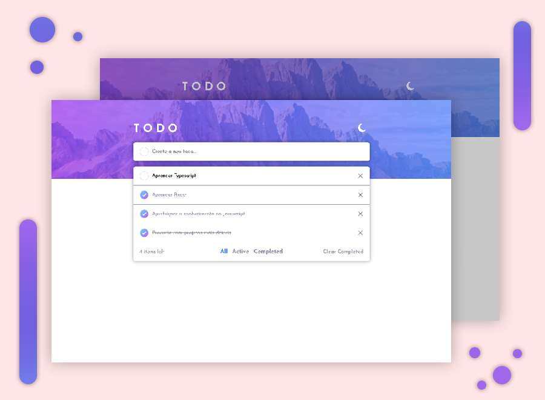

# Frontend Mentor - Todo app challenge solution

Essa é uma solução do [Todo app challenge solution](https://www.frontendmentor.io/challenges/todo-app-Su1_KokOW). Os desafios do frontend Mentor ajudam muito a desenvolver suas habilidades!

## Conteúdos

- [Sobre](#Sobre)
  - [Desafio](#Desafio)
  - [Screenshot](#screenshot)
  - [Links](#links)
  - [Tecnologias usadas](#Tecnologias-usadas)
  - [O que aprendi?](#O-que-aprendi?)
  - [O que busco no futuro?](#O-que-busco-no-futuro?)
- [Author](#Autor)

## Sobre

### Desafio

Os usuários devem conseguir acessar um site responsivo que funcione bem o sistema de criação de tarefas!

### Screenshot

### Links

- Frontend Mentor URL: 
- URL do site: https://todo-list-inky-beta.vercel.app.

### Tecnologias usadas

- React Js.
- React Hooks.
- ARIA acessibilidade.

### O que aprendi?

 Aprendi bastante sobre o React Js e gostei muito de usar mesmo tendo algumas dificuldades,  também achei legal conhecer ARIA para leitores de tela!

### O que busco no futuro?

Busco aprender mais sobre a biblioteca, desenvolver mais projetos e se conseguir aprender Typescript!

## Autor

- Website - https://henriqueamascarin.vercel.app.
- Frontend Mentor - https://www.frontendmentor.io/profile/LuckTheGamers.
